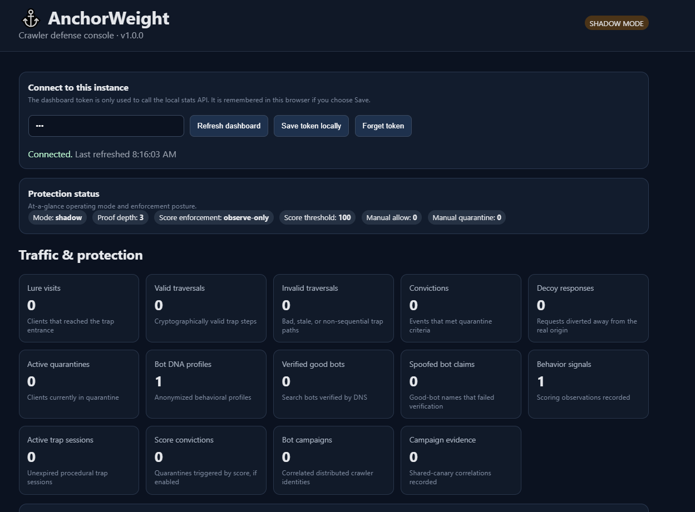

# AnchorWeight v1.1.0

**Let bots identify themselves.**

[](https://github.com/fuhrdan/AnchorWeight/actions/workflows/ci.yml)
[](https://github.com/fuhrdan/AnchorWeight/actions/workflows/codeql.yml)

AnchorWeight is a self-hosted defensive reverse proxy and crawler-identification system. It exposes a bounded procedural lure whose valid paths are cryptographically derived and must be traversed sequentially. A client that follows the issued path to the configured depth establishes **Proof-of-Crawl**. AnchorWeight can then observe that evidence in Shadow Mode or temporarily isolate the client behind inert HTTP 200 decoy responses while normal traffic continues to the private origin.



> **The maze is not the weapon. The maze is the test.**

AnchorWeight is intentionally not an infinite tarpit, bandwidth sink, huge-file generator, or connection-exhaustion system.

## Security Engineering Evidence

AnchorWeight is designed as a **bounded defensive control**, not as a resource-exhaustion mechanism. Its security model emphasizes observable crawler behavior, explicit trust boundaries, reversible enforcement, and conservative defaults.

| Area                                | Evidence                                                                                                                                            |
| ----------------------------------- | --------------------------------------------------------------------------------------------------------------------------------------------------- |
| **Threat model**                    | [THREAT-MODEL.md](THREAT-MODEL.md) documents protected assets, adversaries, trust assumptions, controls, abuse cases, and residual risks            |
| **Architecture / trust boundaries** | [ARCHITECTURE.md](ARCHITECTURE.md) documents request flow, origin isolation, administrative surfaces, crawler evidence, and enforcement boundaries  |
| **Safe rollout**                    | Shadow Mode is enabled by default; proxy and score enforcement remain disabled until an operator deliberately enables them                          |
| **Crawler evidence**                | Proof-of-Crawl uses signed sequential paths rather than treating ordinary browsing behavior as automatic proof of abuse                             |
| **Good-bot verification**           | Claimed Google/Bing identities are verified using reverse and forward DNS rather than trusted from User-Agent strings alone                         |
| **Bounded enforcement**             | Convicted traffic receives deterministic inert HTTP 200 decoys rather than unbounded files, connection exhaustion, or infinite resource consumption |
| **State integrity**                 | Schema compatibility checks and explicit migrations fail closed on corrupt, unsupported-old, or future-version state                                |
| **Release gates**                   | Tests, `npm audit`, release validation, CodeQL, container builds, configuration checks, and runtime diagnostics support production readiness        |

### Safe-by-Default Operating Model

```text
Observe
   ↓
Shadow Mode
   ↓
Collect crawler evidence
   ↓
Verify legitimate automation
   ↓
Review policy
   ↓
Deliberately enable enforcement
   ↓
Temporary, bounded quarantine
```

AnchorWeight intentionally separates **detection evidence** from **enforcement policy**.

A crawler classification, behavioral score, or campaign correlation does not need to become an automatic permanent block. This matters because shared NAT, VPN, mobile, and enterprise egress addresses can represent multiple unrelated users.

The preferred operating model is therefore:

* observe before enforcing;
* use layered evidence rather than one heuristic;
* distinguish verified good bots from unverified identities;
* make quarantine temporary and reversible;
* keep the real origin private;
* preserve evidence and audit history;
* fail safely when configuration or state integrity cannot be established.

## Security Boundary

For Silent Quarantine to provide meaningful isolation, the protected origin must not remain directly reachable from the public Internet.

```text
Internet
   ↓
AnchorWeight
   ├── trusted / normal traffic ──→ private origin
   └── quarantined traffic ──────→ deterministic decoy
```

If clients can bypass AnchorWeight and reach the origin directly, the reverse proxy cannot enforce the intended boundary.

## v1.0.0 highlights

- Signed, sequential **Proof-of-Crawl** procedural lure.
- Whole-site fixed-origin HTTP/HTTPS reverse proxy.
- **Silent Quarantine** with deterministic inert HTML/JSON responses.
- Privacy-conscious **Bot DNA** behavioral profiles.
- Verified Google/Bing crawler claims using reverse + forward DNS confirmation.
- Distributed-crawler **Bot Campaign** correlation using shared signed-canary evidence.
- Investigation dashboard with event explorer, campaign map, timelines, and explicit allow/quarantine policy controls.
- Zero-runtime-dependency operator CLI.
- Named Shadow/Production configuration profiles.
- Log rotation/retention, backup/restore, evidence reports, liveness/readiness, and graceful shutdown.
- Bearer-only admin authentication by default, CSRF-protected mutations, admin rate limiting, audit logging, and request-body bounds.
- **Formal configuration schema v1** and **state schema v5** with supported migrations.
- `state-check`, `migrate`, and `release-check` upgrade/release gates.
- Expanded unit, security, integration, persistence, and proxy test coverage.
- GitHub Actions CI, `npm audit`, CodeQL, and container-build validation.
- Non-root multi-stage Docker image plus cPanel, systemd, Nginx/Apache, and Docker deployment examples.

## v1.1.0 highlights

- **Robots Blackhole** detection using a hidden link explicitly disallowed by `robots.txt`.
- Blackhole evidence feeds the existing Bot DNA and temporary quarantine system.
- Verified good bots and explicit allow policies remain exempt.
- Shadow Mode can measure blackhole activity before enforcement.
- Dashboard metrics for blackhole hits, convictions, and would-quarantine events.
- Existing signed sequential Proof-of-Crawl remains the stronger deep-traversal signal.

## Architecture

```text
                         Internet
                            |
                    trusted front proxy
                      (optional)
                            |
                            v
                    +----------------+
                    |  AnchorWeight  |
                    +----------------+
                      |     |      |
      /anchor lure ---+     |      +--- admin/dashboard
                            |
              +-------------+-------------+
              |                           |
        normal/trusted                convicted
           traffic                     crawler
              |                           |
              v                           v
       PRIVATE ORIGIN              HTTP 200 DECOY
                                    origin hidden
```

For the detailed module/trust-boundary description, see [ARCHITECTURE.md](ARCHITECTURE.md) and [THREAT-MODEL.md](THREAT-MODEL.md).

## Safe defaults

```env
AW_SHADOW_MODE=true
AW_PROXY_ENABLED=false
AW_SCORE_ENFORCEMENT_ENABLED=false
AW_GOOD_BOT_VERIFICATION_ENABLED=true
AW_ALLOW_QUERY_ADMIN_TOKEN=false
```

The recommended rollout is **Shadow Mode first**, inspect real traffic, verify legitimate automation/good bots, then deliberately enable Proof-of-Crawl enforcement. Score-only enforcement remains opt-in.

## Quick start

Requirements: Node.js 20+.

```bash
npm ci --ignore-scripts
npm test

export AW_SECRET='replace-with-a-long-persistent-random-secret'
export AW_DASHBOARD_TOKEN='replace-with-a-long-random-admin-token'

node bin/anchorweight.js check --profile shadow --origin http://127.0.0.1:8081
node bin/anchorweight.js start --profile shadow --origin http://127.0.0.1:8081
```

Then visit:

```text
/dashboard.html
/live
/ready
```

For cPanel hosting, see `deploy/cpanel/README.md`; normal setup uses **Setup Node.js App** with `app.js` as the startup file and environment variables configured in the cPanel UI.

## CLI

```text
start           Start AnchorWeight
check           Validate effective configuration
config          Print redacted effective configuration
profile-list    List named profiles
status          Query a running instance
doctor          Diagnose configuration, live service, API, and origin
profiles        Show Bot DNA profiles
campaigns       Show crawler campaigns
events          Search recent evidence
investigate     Inspect a Bot DNA/campaign timeline
policy          Allow/quarantine/clear a Bot DNA policy
trap-test       Walk a real signed lure chain
backup          Back up state/evidence
restore         Restore a backup
report          Export bounded evidence JSON
prune           Apply retention
state-check     Inspect state-schema compatibility
migrate         Upgrade supported state to v1 schema
release-check   Run config/state release readiness checks
```

See [CLI.md](CLI.md) for flags and examples.

## Upgrading from v0.8/v0.9

Back up before migration:

```bash
anchorweight state-check --profile production
anchorweight migrate --profile production --dry-run
anchorweight backup --profile production --dest ./backups
anchorweight migrate --profile production
```

Supported old state versions are migrated sequentially to the v1.0 state schema. A corrupt, unsupported-old, or future-version state file causes startup to fail instead of silently starting with empty protection history.

## Production release gate

```bash
npm ci --ignore-scripts
npm test
npm audit --audit-level=high
npm run release:check

anchorweight check --profile production --origin http://127.0.0.1:8081
anchorweight release-check --profile production
anchorweight doctor \
  --profile production \
  --origin http://127.0.0.1:8081 \
  --url http://127.0.0.1:8080 \
  --token "$AW_DASHBOARD_TOKEN"
```

The real origin must be private or otherwise inaccessible from the public Internet for whole-site Silent Quarantine to be meaningful.

## Testing and security automation

`npm test` runs isolated module/security tests plus the existing end-to-end proxy, persistence, Proof-of-Crawl, Bot DNA, good-bot, campaign, CLI, and operations regression tests.

GitHub workflows provide:

- Node.js 20/22/24 test matrix.
- `npm audit --audit-level=high` software-composition gate.
- release/source-manifest validation.
- CodeQL JavaScript/TypeScript scanning.
- Docker image build validation.

AnchorWeight has no runtime npm dependencies in v1.1.0, but the audit gate is kept in place so future dependency additions do not silently bypass SCA.

## Documentation

- [ARCHITECTURE.md](ARCHITECTURE.md) — modules, request path, trust boundaries.
- [THREAT-MODEL.md](THREAT-MODEL.md) — assets, adversaries, controls, residual risks.
- [CONFIGURATION.md](CONFIGURATION.md) — configuration reference and precedence.
- [CLI.md](CLI.md) — operator command/flag reference.
- [OPERATIONS.md](OPERATIONS.md) — profiles, retention, backup/restore, lifecycle.
- [DEPLOYMENT.md](DEPLOYMENT.md) — proxy and hosting deployment guidance.
- [SECURITY.md](SECURITY.md) — security posture and reporting guidance.
- [RELEASE.md](RELEASE.md) — v1 release/upgrade checklist.
- [CHANGELOG.md](CHANGELOG.md) — release summary.

## Important limitations

AnchorWeight v1.0 supports a **single process / single local state writer**. The JSON persistence layer is not a distributed datastore. Shared NAT/VPN/mobile IPs can represent multiple users, so AnchorWeight uses temporary quarantine and layered evidence rather than permanent IP bans. Good-bot DNS failure means unverified, not automatically malicious. Bot Campaign correlation is informational by default and does not automatically quarantine an entire cluster.

## License

MIT
